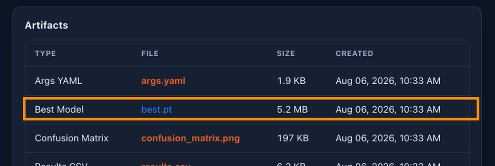

# IKG Studio — Model Training Platform User Manual

**Version 2.0**

This manual documents the web UI of **IKG Studio Model Training Platform**, a browser-based tool for registering image datasets, training / converting / benchmarking computer-vision models, and monitoring background jobs. It does **not** cover deployment or infrastructure setup.

Screenshots are stored in `docs/manual-screenshots/`.

> **Scope of this build.** Only **detection (`DETECT`)** and **oriented bounding box (`OBB`)** tasks are supported. `SEGMENT`, `POSE` and `CLASSIFY` appear in the data model but are reported as disabled by the platform and are rejected by the dataset scanner.

---

## Table of Contents

1. [Concepts & Object Model](#1-concepts--object-model)
2. [Sign In](#2-sign-in)
3. [Roles & Permissions](#3-roles--permissions)
4. [Navigation](#4-navigation)
5. [Home (Dashboard)](#5-home-dashboard)
6. [Datasets](#6-datasets)
   - [6.1 Source Datasets](#61-source-datasets)
   - [6.2 Training Datasets](#62-training-datasets)
7. [Models](#7-models)
8. [Downloading a Trained Model](#8-downloading-a-trained-model)
9. [Training](#9-training)
10. [Benchmarks](#10-benchmarks)
11. [Jobs](#11-jobs)
12. [Notifications](#12-notifications)
13. [Admin](#13-admin)
    - [13.1 Users](#131-users)
    - [13.2 Dataset Types](#132-dataset-types)
    - [13.3 Audit](#133-audit)
    - [13.4 System Settings](#134-system-settings)
    - [13.5 Workers](#135-workers)
    - [13.6 Backup](#136-backup)
14. [Account & Security](#14-account--security)
15. [Status Reference](#15-status-reference)
16. [Troubleshooting & Edge Cases](#16-troubleshooting--edge-cases)
17. [End-to-End Workflow](#17-end-to-end-workflow)

---

## 1. Concepts & Object Model

Five objects carry the whole platform. Everything else is a view over them.

| Object | What it is | Created by |
|---|---|---|
| **Dataset Type** | A category (`cards`, `dice`, …) that scopes everything else and carries three filesystem roots. Types form a **tree**; a child inherits its parent's paths unless it sets its own. | Admin |
| **Source Dataset** | One raw image folder discovered under a type's *dataset path*, plus the result of scanning it (image/label pairs, class list, issues). Read-only — the platform never writes into it. | Registering + scanning a folder |
| **Training Dataset** | A curated YOLO dataset with `train` / `val` / `test` splits and a `data.yaml`. Either **BUILT** from one or more source datasets, or **REGISTERED** by pointing at a directory that is already laid out. | The New Training Dataset wizard |
| **Model** | A `.pt` checkpoint plus its metrics, hyperparameters and lineage. Either trained on the platform or discovered by scanning a type's *model path*. | A training job, or **Scan Model Roots** |
| **Job / Execution** | A **job** is the unit of work you asked for (train this, build that). An **execution** is one attempt at it. A job can have several executions — a retry adds an attempt, it does not create a new job. | Every long-running action |

The chain is: **Dataset Type → Source Datasets → Training Dataset → Training Job → Model → Benchmark Run**.

### Where your data lives

| | What it holds |
|---|---|
| **PostgreSQL** | All state: types, datasets, scans, jobs, executions, models, benchmark runs, audit, notifications, settings |
| **Object storage (MinIO)** | Artifacts: trained weights, training logs, charts, `results.csv`, benchmark outputs, OpenVINO `.zip` exports |
| **Mounted filesystem** | Three roots per dataset type — **dataset path** (source image folders, read-only), **model path** (`.pt` files, the "Model Root"), **training dataset path** (built / registered YOLO directories) |

A trained checkpoint therefore exists in **two** places: as a downloadable artifact in object storage, and as a file under the type's Model Root on the server. [Section 8](#8-downloading-a-trained-model) explains how to get at both.

---

## 2. Sign In

Navigate to the platform URL. The login screen offers a username/password form and a passkey (WebAuthn) button.

Enter credentials and click **Sign in**. On failure an inline error is shown and the form stays editable:

> **Account lockout.** After `auth_failed_login_threshold` failed attempts (default 5) the account is locked for `auth_lockout_minutes` (default 15). A locked account shows status `LOCKED` on the Admin → Users page and an admin can clear it early with **Unlock**. See [System Settings](#134-system-settings).

Sessions expire on two independent clocks: `auth_session_idle_minutes` (default 480) and `auth_session_absolute_hours` (default 24).

---

## 3. Roles & Permissions

There are two roles.

| Capability | ADMIN | USER |
|---|---|---|
| Source datasets — register, rescan, class override, archive | ✓ | ✓ |
| Training datasets — create, build, register, re-validate | ✓ | ✓ |
| **Delete a training dataset** | ✓ | ✗ |
| Models — view, Scan Model Roots, **download artifacts** | ✓ | ✓ |
| **Delete a model** | ✓ | ✗ |
| **Create / delete an OpenVINO conversion** | ✓ | ✗ |
| Training jobs — create, stop, retry | ✓ | ✓ |
| Benchmark runs — create, stop, retry | ✓ | ✓ |
| Jobs, Notifications, per-resource History | ✓ | ✓ |
| Workers list | ✓ | ✓ |
| **Admin section** (Users, Dataset Types, Audit, System Settings, Backup) | ✓ | ✗ |
| **Browse the server filesystem** (path pickers) | ✓ | ✗ |

> Earlier versions of this manual said a USER could do everything an admin could except open the Admin tab. That is **not** correct: deleting a model, deleting a training dataset, and creating or deleting an OpenVINO conversion are admin-only. The buttons are hidden for USERs and the API rejects the calls with HTTP 403.

Note also that **benchmark runs cannot be deleted by anyone** — there is no delete endpoint. A run can only be stopped, cancelled or retried.

The **Admin** nav entry is rendered only for `ADMIN` sessions. If a stale "admin" page survives a user switch on the same browser, the shell sends you back to Home. Browsing state is reset on every sign-in and sign-out, so nothing leaks between accounts.

---

## 4. Navigation

The top app bar contains the brand, the primary nav (**Home · Datasets · Models · Training · Benchmarks · Jobs · Notifications**, plus **Admin** for admins), your role badge, an account button and **Sign Out**.

**There is no URL router.** The page you are on is remembered in browser storage, not in the address bar. Query parameters such as `?modelId=…`, `?trainingJobId=…`, `?jobId=…` only select *which record* the currently open page shows — they cannot switch pages. A link with `?modelId=…` therefore only works if the recipient is already on the Models tab.

**Back remembers where you came from.** Jumping model → training job and pressing **← Back** returns to the model, not to the training list. The same applies to training dataset → source dataset, and model → training dataset.

**Live updates.** The app holds a server-sent-event stream open and also polls (jobs, models and datasets every 5 s; the unread badge and dashboard every 20 s; an open log tail every 3 s). Job states, notification badges and conversion progress update on their own — you do not need to refresh.

---

## 5. Home (Dashboard)

- **Counters** — Source Datasets, Training Datasets, Models, Training Jobs, Benchmarks
- **System Health** — workers online/offline/total, active executions, pending outbox, dead-letter outbox
- **Active Jobs** — what is running or queued right now
- **Recent Models**, **Recent Benchmarks**, **Recent Activity** (latest audit events)

Two banners can appear above any page, for every signed-in user:

- **Storage Usage Warning** — MinIO usage has passed `storage_warning_threshold_percent` (default 85%).
- **Storage Limit Exceeded** — the quota in `storage_minio_limit_bytes` is full and **uploads and executions are write-blocked**. Free space by deleting unused models, conversions or benchmark artifacts.

---

## 6. Datasets

Two sub-tabs: **Source** (raw folders on disk) and **Training** (curated, split datasets).

Both tabs group rows by dataset type in collapsible bands, remember which bands you left open, and offer **Expand all / Collapse all**.

### 6.1 Source Datasets

Each type band shows a stats strip (folders / registered / types / images) and, when expanded, one card per folder found under the type's dataset path.

**Per group:** a folder name filter, a multi-select status filter with live counts (`READY (12)`, `Not registered (5)`, …), **Select all / Deselect all**, **Rescan type** (rebuilds the type's directory index), **Scan & register all** (asks for confirmation above 10 folders), and **Scan & register selected (*n*)** once you tick a subset.

**Per card:** scan status, image / pair counts, class count, last-scan time, **Rescan**, and **Archive**.

- A card warning **"⚠ classes.txt missing — using type fallback"** means the folder had no class list and the type's fallback was used.
- A card reading **"⚠ folder not found on disk — open it to archive"** is a registered dataset whose folder has left the directory index (the type's path changed, or the folder moved). **Rescan** recovers it if the folder comes back; otherwise archive it.

**Archiving.** Archive hides a source dataset from the grid and stops it being used for new training datasets. **Nothing on disk is touched**, and training datasets already built from it are unaffected. Archive is **one-way** — to use the folder again you must register it afresh. Tick several cards to get **Archive selected (*n*)**; the operation runs one dataset at a time so a partial failure tells you exactly which one failed. Tick **Show archived** in the page header to see a read-only band of archived datasets per type.

**Detail page.** Clicking a folder opens its detail page:

It shows the **latest** scan (`Scan #<version>`) — not a history — with:

- a statistics block: images, labels, matched pairs, missing images, missing labels, invalid labels, empty labels, warnings, errors, finished time;
- a **Classes** table (index / name / object count) with a badge saying where the class list came from;
- a **Scan Issues** table (severity, code, image, label, line, details);
- for an `INVALID` dataset, a red banner grouping the errors by code with a plain-English label and an example file and line — e.g. *"Class index gap — label files reference class ids missing from the class list"*.

**Class list override.** If the folder's `classes.txt` is missing or wrong, the detail page can override it: an editor whose line numbers *are* the class ids, an **Upload classes.txt** picker, and **Save & rescan**, which validates every label file against the new list first. The override is stored on the record and **never written into the source folder**; **Clear override** returns to the on-disk list.

**Sample preview.** The preview panel renders thumbnails with the boxes already drawn, 24 per page. Click one for the full-size modal:

Modal keys: **← / A** previous, **→ / D** next (wrapping), **Esc** close, and **L** to toggle the class-name tags (there is also a **Labels** button). Both axis-aligned and oriented boxes are drawn, each class in its own colour. Training datasets get **train / val / test** tabs; source datasets are flat.

### 6.2 Training Datasets

Click an entry for its configuration, class list, split counts and lineage back to the source datasets:

**New Training Dataset.** The wizard's length depends on the origin you pick in step 1.

**Step 1 — Type & Origin.** Choose the dataset type, then one of:

- **Build from source datasets** (`BUILT`) — merge scanned source datasets, compute a split and write `data.yaml`.
- **Register an existing directory** (`REGISTERED`) — point at a YOLO directory that already has `data.yaml` and split folders. It is **validated, not rebuilt**.

**Registering** collapses the wizard to three steps — Type & Origin → Details → **Directory** — where you pick the folder with a browser rooted at the type's training-dataset path. The final button reads **Register & Validate**.

**Building** continues through five steps:

2. **Details** — name and task type (`DETECT` or `OBB`). Each task shows a live count of READY source datasets of that task under the type, and is disabled when there are none.
   
3. **Sources** — pick the source datasets to merge, with a text filter and select all / none. Datasets still scanning are called out as a prerequisite.
   
4. **Classes** — a **read-only** preview of the merged class list (index / name / which sources contribute it). You cannot rename or deselect classes here. If two sources disagree about what a class index means, the conflict is shown struck-through and **blocks the wizard** — go back and deselect the conflicting source.
   
5. **Split** — the strategy and ratios. Two strategies exist:
   - **Random split** — shuffle with a fixed seed. Ratio presets (80/10/10, 70/20/10, 80/20/0, 90/10/0, 1/1/1), three editable ratios that must sum to 1.00 with train > 0, a live ratio bar, and a seed field. A warning appears if the train share is very low.
   - **Same split** — keep whatever split the sources already carry. It ignores the ratio fields entirely and must be acknowledged explicitly.

   

**Create & Build** queues a **Dataset Build** job; **Register & Validate** queues a **Training Dataset Scan**. Either way, watch it on the [Jobs](#11-jobs) page.

---

## 7. Models

Models are grouped by dataset type. Columns: **Name, Architecture, Task, imgsz, Classes, Status, Size, Added**. A model trained here carries a *Trained here* pill and a `from <base weights>` sub-line.

**Scan Model Roots** re-indexes each type's Model Root and reports back in plain language — *"N checkpoints found · M newly registered · K Model Root missing on disk"*. This is also the **only way to bring an outside model in through the UI**: drop the `.pt` into the type's Model Root and rescan. (The API has URL and file-upload ingest endpoints, and "Model Ingest" appears as a job type, but no screen in this build starts one.)

**Model detail** shows the file name, size and checksum, training curves, validation metrics, the training job and dataset it came from, a reconstructed `yolo train …` command line (rebuilt from the stored hyperparameters, with a copy button), the artifacts table, and any OpenVINO conversions.

Click any chart to enlarge it:

### Convert to OpenVINO — admin only

Shown only while the model is `AVAILABLE`. It is a **single modal**, not a wizard:

- **Image Size** — `imgsz` (32–4096, in steps of 32), with a *Non-square imgsz* toggle that adds a width field.
- **Export Options** — `batch`, `opset`, `max_det` (default 300), `dynamic`, `simplify` (on by default), `nms`.
- An editable **Export CLI** box. Typing in it overrides the form; every `key=value` is validated against the pinned Ultralytics version, with per-argument errors and "did you mean" suggestions. `model` and `format=openvino` are fixed. **INT8 quantisation is not supported** — it needs a calibration dataset.

There is **no device or precision choice**: the conversion runs on the worker's configured device. The output is OpenVINO IR (`.xml` + `.bin`) packed into a single `.zip` artifact in object storage. Nothing is written to the Model Root.

The **OpenVINO Conversions** card below lists every conversion with **Status, Args, Created, Size, Download** and an admin-only delete. It refreshes itself every few seconds while a conversion is queued or running, shows the failure message inline in red when one fails, and clicking a row jumps to that job on the Jobs page.

### Delete — admin only

Offered while the model is not already `DELETED`. The confirmation first lists what will be left dangling: training jobs that used it as a base, the training job that produced it, and benchmark runs that reference it. Deletion is a **soft delete** — the record stays with status `DELETED`, the `.pt` is unlinked from the Model Root, and every OpenVINO conversion and its artifact is removed for good. The file removal is fire-and-forget and does **not** appear on the Jobs page.

---

## 8. Downloading a Trained Model

> This is the question users ask most often, so it gets its own section. Short answer: **Models → open the model → scroll to the Artifacts card → click `best.pt` in the "Best Model" row.**

### 8.1 From the model page (the normal route)

1. Open **Models** and click the model you want.
2. Scroll to the bottom of the page, past the charts and the Training block, to the **Artifacts** card.
3. Find the row whose **Type** is **Best Model**. Its **File** cell is `best.pt`.
4. Click the file name. The browser downloads it.

> **Why it is easy to miss.** The card is called *Artifacts*, not *Download*, and there is no download button or icon — the file name itself is the link. Worse, every other row in that table (`args.yaml`, `confusion_matrix.png`, `results.csv`, `training.log`, the batch previews) is a **preview** link and is rendered in orange, while `best.pt` — the one file you actually want — is a plain link in a different colour. Look for the row labelled **Best Model**, not for a button.

The **File** line at the top of the Model card also shows `best.pt (5.2 MB)`, but that is a label, not a link.

Both **ADMIN** and **USER** can download artifacts. The file is streamed through the platform (it is not a direct object-storage link), so nothing extra needs to be reachable from your machine.

### 8.2 From the training job

The same checkpoint is attached to the training run. **Training → the job → Artifacts card → Best Model** gives you the identical file.

The model page hides the job's copy when the model already carries its own, so you see the row once, not twice.

### 8.3 What else is in that table

| Type | File | Use |
|---|---|---|
| **Best Model** | `best.pt` | **The trained weights.** This is what you deploy or fine-tune from. |
| Args YAML | `args.yaml` | Every hyperparameter the run actually used |
| Results CSV | `results.csv` | Per-epoch metrics, for your own plots |
| Training Log | `training.log` | Full console output |
| Confusion Matrix / Training Output / Validation | `*.png`, `*.jpg` | Charts and sample batches — these open in a preview, they do not download |

Rows that are images or text open in an in-app preview when clicked. Anything else — `best.pt` included — downloads.

### 8.4 The OpenVINO export

If you need IR rather than PyTorch weights, use **Convert to OpenVINO** (admin only, [Section 7](#7-models)) and then the **Download** column of the **OpenVINO Conversions** table. That one *is* labelled "Download". You get a `.zip` containing the `.xml` and `.bin`.

### 8.5 On the server

Every model trained here is also written as a `.pt` under its dataset type's **Model Root** (Admin → Dataset Types → *model path*). If you have shell access to the server that is the fastest way to collect many checkpoints at once; through the browser, use the Artifacts table.

---

## 9. Training

The Training page lists every training job. Filters for status, type, model and dataset **cascade** — choosing a model narrows the dataset list and vice versa — plus a sort control (newest / oldest / name) and **Reset filters**. Each row has **Stop** and **Retry** where the status allows it.

The detail page adds:

- **Executions** — one row per attempt (Attempt, Status, Progress, Started, Finished, Error), headed "*N* attempts". This is where automatic retries become visible; see [Section 16](#16-troubleshooting--edge-cases).
- **History** — the audit trail for this job, available to USERs as well as admins.
- Live training curves and a live log tail once the run starts.

### New Training Job — five steps

1. **Dataset Type** — everything downstream is scoped to it.
   
2. **Model** — either **Official YOLO model** (Ultralytics pretrained, fetched by the worker on first use; you choose version and size and the resolved weights file name is previewed) or **Model registered here** (any `AVAILABLE` model of this type, i.e. fine-tuning).
   
3. **Training Dataset** — a searchable list of `READY` datasets with an image and class summary, plus a **job name** (leave blank to auto-name from the type and today's date). Two things block this step: a task-type mismatch between model and dataset, and asking for official OBB weights where that YOLO version has none.
   
4. **Hyperparameters** — the device picker plus five collapsible groups: **Basic** (epochs, imgsz, batch, cache, val), **Optimizer** (optimizer, lr0, lrf, momentum, weight_decay, warmup_epochs, cos_lr), **Augmentation** (hsv_h/s/v, degrees, translate, scale, shear, flipud, fliplr, mosaic, mixup, copy_paste), **Regularization** (dropout, patience, single_cls) and **Advanced** (workers, seed, save_period, deterministic, multi_scale, rect).
   
   
5. **Review & CLI** — the generated `yolo train …` command, editable. Editing the form regenerates the line; editing the line overrides the form (marked *edited*, with a **Reset**). Arguments are validated against the pinned Ultralytics version.

**Device picker.** Auto-detect, CPU, or one *or several* GPUs — GPU entries are toggles that accumulate into `device=0,1`, and the summary reads "2 GPUs (device=0,1)". Only GPUs reported by **online training workers** are listed, with their live memory and utilisation.

Submitting queues a **Training** job, trackable from [Jobs](#11-jobs) and [Notifications](#12-notifications).

---

## 10. Benchmarks

A benchmark run evaluates a model against a training dataset's splits and produces comparable metrics (mAP50, mAP50-95, precision, recall, F1). The underlying schema supports a model × dataset matrix, but the **New Benchmark Run** wizard creates **one model against one dataset** — use **Compare Models** to put several models side by side afterwards.

### Run detail

Three view modes:

- **Matrix Table** — the model × dataset grid.
  
- **Visual Result Chart** — bars comparing mAP50, F1, precision and recall.
  
- **Detailed List** — one row per evaluation, each with **View Charts** for its confusion matrix, PR curves, per-class charts and logs.
  
  

**Stop** moves a running run to `STOPPING` (queued evaluations are cancelled outright); anything not running or queued refuses.

> **Retry replaces the whole run.** Retry is only offered once a run has finished, and it re-queues **every** evaluation in that run — not just the failed ones — in place, on the same run record. Doing so **clears the existing metrics first**, so retrying a `PARTIALLY_FAILED` run discards the results of the cells that had succeeded and computes them again. There is no per-cell retry. Retry is refused if any model in the run is no longer `AVAILABLE` or any dataset no longer `READY`.

### Compare Models

A three-step wizard: **Dataset Type → Select Models → Compare**. Types with fewer than two models are disabled, and within a type only models that already have a completed evaluation are selectable — the rest are greyed with *"no completed evaluation for this dataset type"*.

The result view has a **Radar / Bars** toggle, an overlay of the models' training curves, a **⬇ CSV** export (overall metrics plus one column per class) and a **⬇ PNG** export that works in Radar mode only.

### New Benchmark Run — five steps

1. **Dataset Type & Name**
   
2. **Select Model** — one model.
   
3. **Select Dataset** — one training dataset.
   
4. **Device** — auto, CPU or a specific GPU, with live worker stats.
   
   
5. **Review** — the summary plus a **Workers online** table, then **Create & Launch Benchmark**.
   

Steps are strictly sequential — you cannot skip ahead.

---

## 11. Jobs

Every background job across every subsystem, whichever page launched it.

Job types: **Training, Dataset Build, Dataset Validate, Dataset Scan, Benchmark Eval, Model Ingest, Model Conversion**. Quick filters **All / Active / Completed / Failed** sit alongside a type filter; both are remembered across reloads. The list refreshes every few seconds and loads more as you scroll.

Each row shows the job kind, name, **technical status** (the execution's own state) with the **business status** in parentheses (the state of the thing it was working on), progress, duration and timestamp. See [Status Reference](#15-status-reference).

Clicking a row opens a **modal** with the run's log. While the execution is active the log re-polls every few seconds and follows the tail; scroll up and it pauses following until you scroll back down.

> Model deletion and Model Root scans are fire-and-forget and never appear here.

---

## 12. Notifications

System events raised per user — job completions, failures, scan problems. The nav badge shows the unread count and updates without a refresh.

Controls: **Mark all read**, per-item **Mark read**, an **Unread only** checkbox, a severity filter and **Reset filters**. The list loads more as you scroll and shows a total in the header.

Three severities: **✓ SUCCESS** (green), **! WARNING** (yellow) and **✕ ERROR** (red). For example, a scan that finishes cleanly raises a ✓ *Dataset Scan Completed*; one that finishes `INVALID` raises *Dataset Scan Found Problems*.

---

## 13. Admin

Admins only. Six sub-tabs.

### 13.1 Users

Accounts have status `ACTIVE`, `DISABLED` or `LOCKED`, and the available actions depend on it: **Disable / Enable**, **Make Admin / Make User** (never on your own account), **Reset Password**, and **Unlock** for a locked account.

**+ New User** takes a username, display name, optional email, role, and a password mode.

> **Use "Manual" password mode.** In this build the *Generated* mode creates the account but never shows you the generated password, leaving the user unable to sign in. Set a password yourself and hand it over.

The platform refuses to demote or disable the **last active admin**.

### 13.2 Dataset Types

Dataset types form a **tree**, not a flat list — rows expand, children are indented, and depth is capped by `dataset_type_max_depth` (default 8).

Each node carries three absolute filesystem roots — **dataset path** (source folders), **model path** (`.pt` files) and **training dataset path** (built or registered YOLO directories) — plus an enabled flag and usage counts. A node without its own path **inherits** the nearest ancestor's, displayed as *"(inherited)"*.

**Edit** changes the name, description and the three paths. Each path is checked for existence as you type, has a **Browse…** picker, and must differ from the other two. Concurrent edits are rejected rather than silently overwritten.

Other actions: **Disable / Enable**, and **Delete** — refused while any child type, source dataset, training dataset or model still references the type, and it names the blockers. Deleting removes only the type and its cached folder index; nothing on disk is touched. Types marked **system** are read-only.

**New Root Type** creates a top-level type. In this build child types can only be created through the API.

### 13.3 Audit

Every auditable action — logins, resource creation, job lifecycle — with actor, action, resource type and id, result, and a correlation id. Filter by action, resource type, result, actor type and date range, and **Export CSV**. Clicking a **correlation id** opens every event from the same operation across subsystems.

Per-resource **History** cards on models, training jobs and dataset types show the same data scoped to one record, and are visible to USERs too.

### 13.4 System Settings

Grouped by category:

- **Authentication** — `auth_failed_login_threshold` (5), `auth_lockout_minutes` (15), `auth_session_idle_minutes` (480), `auth_session_absolute_hours` (24)
- **Models** — `model_download_allow_http`, `model_download_allow_private` (both SSRF-risk toggles), `model_min_size_bytes`, `model_root`, `model_upload_max_size_bytes` (2 GiB)
- **Datasets** — `dataset_type_max_depth` (8), `managed_dataset_root`
- **Workers & queue** — `worker_offline_timeout_seconds` (90), `queue_wait_warning_minutes` (30)
- **Storage** — `storage_minio_limit_bytes` (100 GiB), `storage_warning_threshold_percent` (85), `workspace_retention_hours` (24), `workspace_root`

Settings are saved **one row at a time**: edit a field and that row grows **Revert** and **Save** buttons, with an "*N* unsaved" badge in the header. Byte values get an MB/GB/TB unit selector. Secret values show as *hidden* and cannot be edited here. Changes take effect on the next operation that reads the setting.

### 13.5 Workers

A read-only list of registered workers: type, online/offline, hostname, active job count, runtime versions (Python, torch, ultralytics, CUDA), and heartbeat and registration times. **There is no enable / disable / drain action** — a worker goes offline by stopping, or by missing heartbeats for `worker_offline_timeout_seconds`.

GPU inventory is not shown here; it appears in the device picker when you launch a training job or benchmark.

### 13.6 Backup

**Export** downloads `ikg-backup-<timestamp>.json` containing all users (including password hashes), dataset types, system settings (including secret values) and registered passkeys. Treat the file as a credential.

**Import** replaces those four tables in a single transaction. Your own account survives — it is re-pointed at the matching admin in the file, so your session stays valid — but **every other user is signed out**. The import rolls back if any dataset type is still referenced by a source dataset, training dataset or model, which in practice means it is only usable on a system that has no dataset or model data yet. Datasets, models, jobs, benchmarks, artifacts and audit logs are never touched.

---

## 14. Account & Security

Shows your username, display name and role (read-only), plus:

- **Change password** — current password, new password, confirmation.
  
- **Passkeys** — register WebAuthn credentials for passwordless sign-in, and remove ones you no longer use. A registered passkey is what makes the passkey button on the login page work.

---

## 15. Status Reference

### Execution status — the technical state of one attempt

`ASSIGNED` → `CLAIMED` → `PREPARING` → `RUNNING` → `SUCCEEDED` / `FAILED` / `CANCELLED` / `STOPPED` / `LOST`

The Jobs page quick filters map onto these: **Active** = assigned, claimed, preparing, running · **Completed** = succeeded · **Failed** = failed, cancelled, stopped, lost.

### Business status — the state of the thing being worked on

| Job type | Business status comes from |
|---|---|
| Training | the training job |
| Dataset Build / Training Dataset Scan | the training dataset |
| Dataset Scan | the **scan**, not the source dataset |
| Benchmark Eval | the evaluation |
| Model Ingest | the ingest task |
| Model Conversion | the conversion |

### Training job

`SCHEDULED · QUEUED · PREPARING · RUNNING · STOPPING · COMPLETED · FAILED · CANCELLED · STOPPED · BLOCKED`

**`BLOCKED`** means the job is waiting for another job to finish. The scheduler promotes it once its dependencies complete, and fails it if one of them fails. Dependencies can only be set through the API in this build, so `BLOCKED` will not appear for jobs created in the UI.

### Benchmark run

`QUEUED · RUNNING · COMPLETED · PARTIALLY_FAILED · FAILED · CANCELLED · STOPPING · STOPPED`

`PARTIALLY_FAILED` means some evaluations succeeded and some did not; the successful metrics are kept. Note that the list page's status filter does not offer `STOPPING` or `STOPPED`, so a stopped run cannot be filtered for.

### Benchmark evaluation

`PENDING · QUEUED · RUNNING · COMPLETED · FAILED · CANCELLED · STOPPING · STOPPED`

### Model

`AVAILABLE` · `DELETED` (soft delete — the record stays, the file is unlinked)

### User

`ACTIVE · DISABLED · LOCKED`

---

## 16. Troubleshooting & Edge Cases

**A job says `LOST`.** The worker stopped sending heartbeats. The scheduler marks the execution `LOST` and then carries the failure into the object being worked on — it does not leave it hanging:

| Job type | What happens next |
|---|---|
| Training | retried automatically with a new attempt, up to a configured limit, then `FAILED`. If it was already stopping, it becomes `STOPPED`. |
| Dataset Scan | the scan fails and the source dataset goes back to `REGISTERED` — not `INVALID`, since the scan never actually ran |
| Dataset Build / Training Dataset Scan | the training dataset becomes `INVALID` |
| Benchmark Eval | the evaluation fails and the parent run is finalised so it cannot hang in `RUNNING` |
| Model Conversion | the conversion becomes `FAILED` |

The log will show `Execution lost: no heartbeat within timeout`.

**A training job shows "attempt 3".** Some failures are retried automatically with a growing delay — temporary storage failures, database connection failures, network and Redis timeouts. Everything else (a bad dataset, missing labels, an unreadable model, a checksum mismatch, invalid configuration) is treated as permanent and fails on the first attempt. The **Executions** table on the job detail page shows each attempt and its error.

**A detail page says the record no longer exists.** Opening a URL with an id that has been deleted — or that you cannot see — shows an explicit error panel with a **← Back** button. There is no 404 page because there are no page URLs; a `?modelId=…` parameter only takes effect if the Models tab is already open.

**A source dataset scan finished `INVALID`.** Open the dataset's detail page: the red banner groups the errors by code with an example file and line. Common causes are class indices in the labels that are missing from the class list, and label files with no matching image. Fix the folder, or set a class list override, then **Rescan**.

**A source dataset card says the folder is not on disk.** Its folder left the directory index. **Rescan** recovers it if the folder is back; otherwise **Archive** it.

**"Storage Limit Exceeded" is showing.** MinIO is at its quota and new uploads and executions are blocked. Delete unused OpenVINO conversions, models or benchmark artifacts, or raise `storage_minio_limit_bytes`.

**A benchmark run finished `PARTIALLY_FAILED` and I want the failed cells re-run.** There is no way to re-run a single cell. Retry re-runs the whole run and clears the metrics of the cells that succeeded before recomputing them — so either accept that, or create a new run for the failing pair.

**A new user cannot sign in.** If the account was created with the *Generated* password mode, no one ever saw the password. Reset it from Admin → Users with a password you choose.

**Repeated failed sign-ins lock the account.** Status becomes `LOCKED`; wait `auth_lockout_minutes` or ask an admin to **Unlock**.

---

## 17. End-to-End Workflow

1. **Admin** creates a **dataset type** with its three filesystem roots (Admin → Dataset Types).
2. Someone drops raw image folders under the type's **dataset path**.
3. On **Datasets → Source**, expand the type and **Scan & register** the folders. Fix anything that comes back `INVALID`, using a class list override where the folder's `classes.txt` is wrong.
4. On **Datasets → Training**, build a **training dataset** from the source datasets (or register a directory that is already split).
5. On **Training**, launch a **training job**: pick the type, an official or registered model, the dataset, the hyperparameters and the device.
6. Watch it on **Jobs**; the result appears under **Models**.
7. **Download the weights** from the model's Artifacts card — see [Section 8](#8-downloading-a-trained-model) — or convert to OpenVINO if you need IR.
8. On **Benchmarks**, evaluate the model against a dataset, then use **Compare Models** to put candidates side by side and export the comparison.
